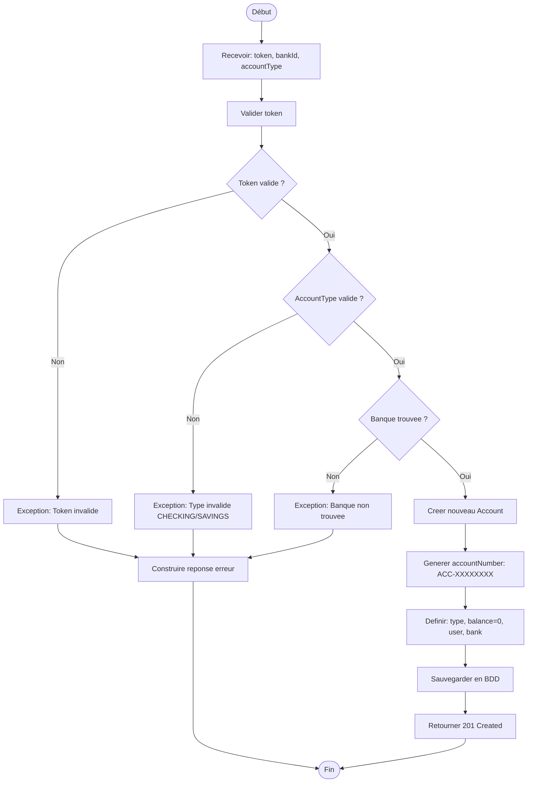

```mermaid
flowchart TD
    Start(["Début"]) --> Input["Recevoir: token, bankId, accountType"]
    Input --> ValidateToken["Valider token"]
    ValidateToken --> ValidToken{"Token valide ?"}
    ValidToken -->|Non| ErrorToken["Exception: Token invalide"]
    ValidToken -->|Oui| ValidateType{"AccountType valide ?"}
    ValidateType -->|Non| ErrorType["Exception: Type invalide CHECKING/SAVINGS"]
    ValidateType -->|Oui| FindBank{"Banque trouvee ?"}
    FindBank -->|Non| ErrorBank["Exception: Banque non trouvee"]
    FindBank -->|Oui| CreateAcc["Creer nouveau Account"]
    CreateAcc --> GenNum["Generer accountNumber: ACC-XXXXXXXX"]
    GenNum --> SetFields["Definir: type, balance=0, user, bank"]
    SetFields --> SaveAcc["Sauvegarder en BDD"]
    SaveAcc --> ReturnAcc["Retourner 201 Created"]
    ErrorToken --> BuildError["Construire reponse erreur"]
    ErrorType --> BuildError
    ErrorBank --> BuildError
    ReturnAcc --> Return(["Fin"])
    BuildError --> Return
```