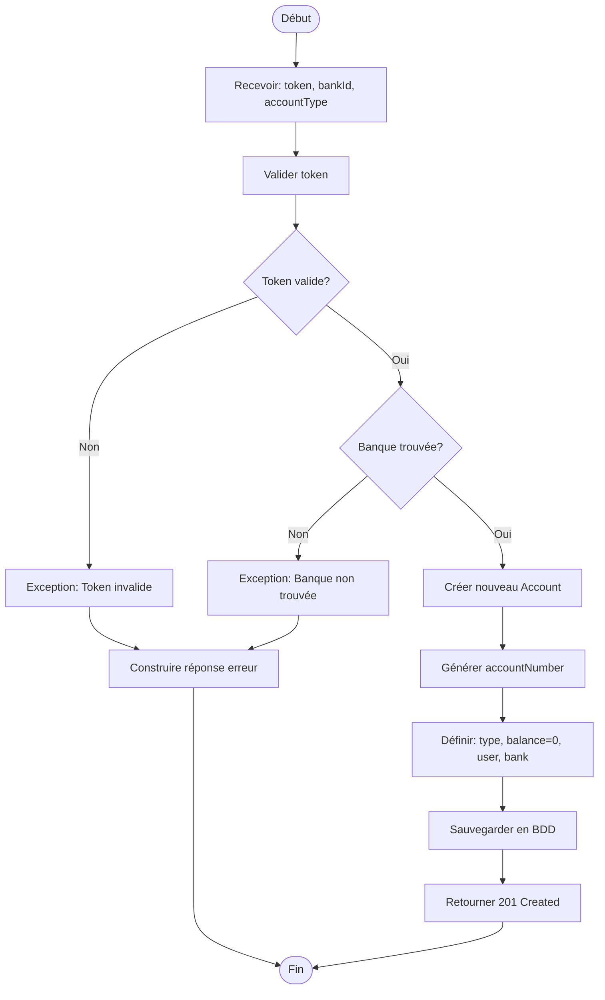

```mermaid
flowchart TD
    Start(["Début"]) --> Input["Recevoir: token, bankId, accountType"]
    Input --> ValidateToken["Valider token"]
    ValidateToken --> ValidToken{"Token valide?"}
    ValidToken -->|"Non"| ErrorToken["Exception: Token invalide"]
    ValidToken -->|"Oui"| FindBank{"Banque trouvée?"}
    FindBank -->|"Non"| ErrorBank["Exception: Banque non trouvée"]
    FindBank -->|"Oui"| CreateAcc["Créer nouveau Account"]
    CreateAcc --> GenNum["Générer accountNumber"]
    GenNum --> SetFields["Définir: type, balance=0, user, bank"]
    SetFields --> SaveAcc["Sauvegarder en BDD"]
    SaveAcc --> ReturnAcc["Retourner 201 Created"]
    ErrorToken --> BuildError["Construire réponse erreur"]
    ErrorBank --> BuildError
    ReturnAcc --> Return(["Fin"])
    BuildError --> Return
```