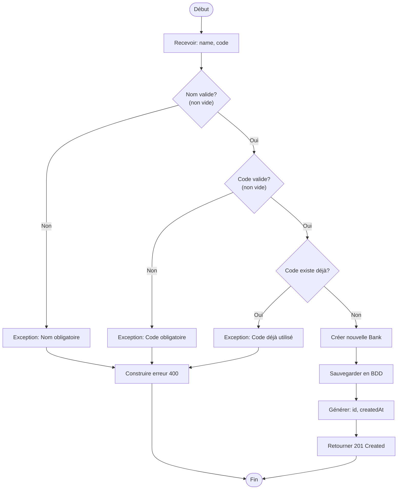

```mermaid
flowchart TD
    Start(["Début"]) --> Input["Recevoir: name, code"]
    Input --> ValidateName{"Nom valide?<br/>(non vide)"}
    ValidateName -->|"Non"| ErrorName["Exception: Nom obligatoire"]
    ValidateName -->|"Oui"| ValidateCode{"Code valide?<br/>(non vide)"}
    ValidateCode -->|"Non"| ErrorCodeEmpty["Exception: Code obligatoire"]
    ValidateCode -->|"Oui"| CheckCode{"Code existe déjà?"}
    CheckCode -->|"Oui"| ErrorCode["Exception: Code déjà utilisé"]
    CheckCode -->|"Non"| CreateBank["Créer nouvelle Bank"]
    CreateBank --> SaveBank["Sauvegarder en BDD"]
    SaveBank --> AutoGen["Générer: id, createdAt"]
    AutoGen --> ReturnBank["Retourner 201 Created"]
    ErrorName --> BuildError["Construire erreur 400"]
    ErrorCodeEmpty --> BuildError
    ErrorCode --> BuildError
    ReturnBank --> Return(["Fin"])
    BuildError --> Return
```