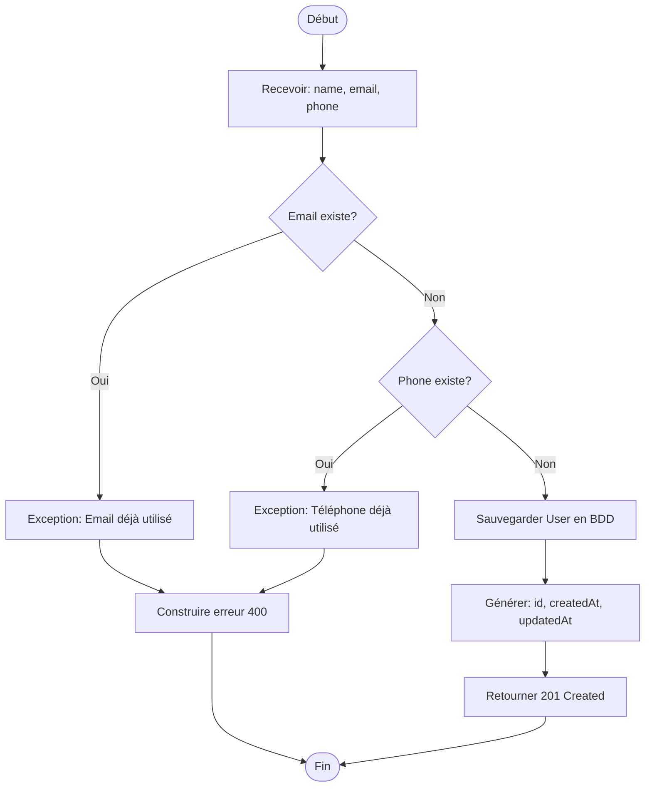

```mermaid
flowchart TD
    Start(["Début"]) --> Input["Recevoir: name, email, phone"]
    Input --> CheckEmail{"Email existe?"}
    CheckEmail -->|"Oui"| ErrorEmail["Exception: Email déjà utilisé"]
    CheckEmail -->|"Non"| CheckPhone{"Phone existe?"}
    CheckPhone -->|"Oui"| ErrorPhone["Exception: Téléphone déjà utilisé"]
    CheckPhone -->|"Non"| SaveUser["Sauvegarder User en BDD"]
    SaveUser --> AutoFields["Générer: id, createdAt, updatedAt"]
    AutoFields --> ReturnUser["Retourner 201 Created"]
    ErrorEmail --> BuildError["Construire erreur 400"]
    ErrorPhone --> BuildError
    ReturnUser --> Return(["Fin"])
    BuildError --> Return
```