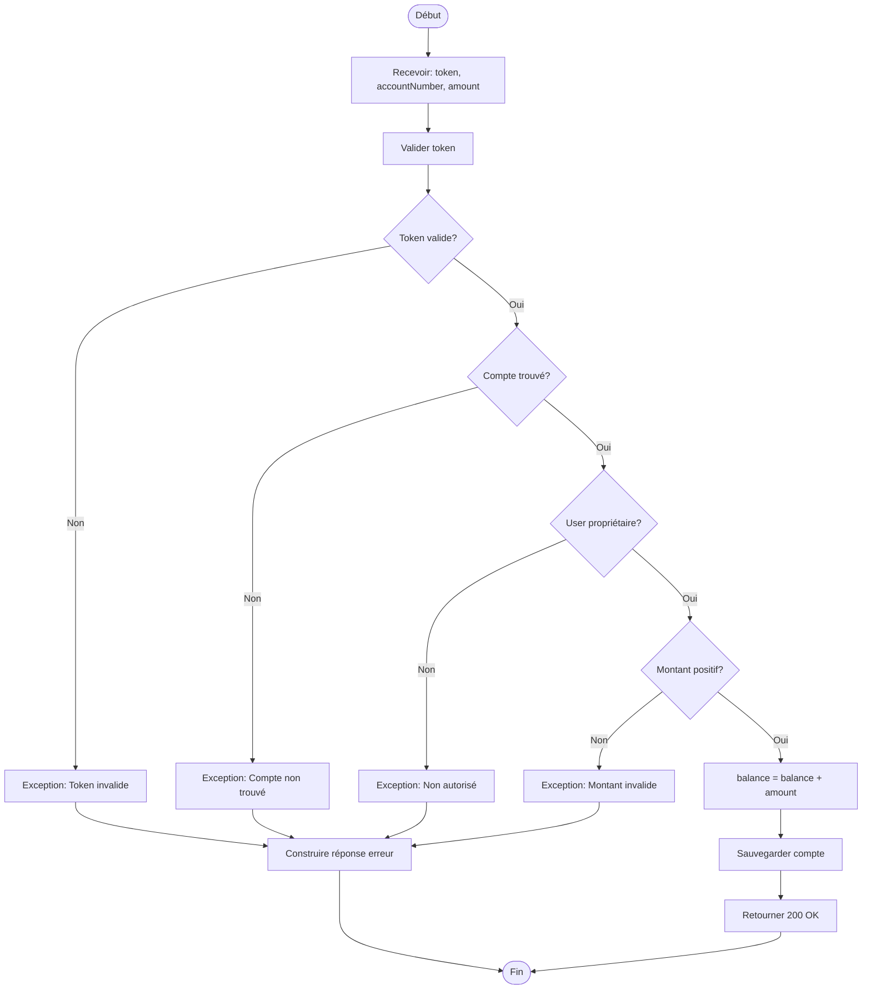

```mermaid
flowchart TD
    Start(["Début"]) --> Input["Recevoir: token, accountNumber, amount"]
    Input --> ValidateToken["Valider token"]
    ValidateToken --> ValidToken{"Token valide?"}
    ValidToken -->|"Non"| ErrorToken["Exception: Token invalide"]
    ValidToken -->|"Oui"| FindAcc{"Compte trouvé?"}
    FindAcc -->|"Non"| ErrorAcc["Exception: Compte non trouvé"]
    FindAcc -->|"Oui"| CheckOwner{"User propriétaire?"}
    CheckOwner -->|"Non"| ErrorOwner["Exception: Non autorisé"]
    CheckOwner -->|"Oui"| CheckAmount{"Montant positif?"}
    CheckAmount -->|"Non"| ErrorAmount["Exception: Montant invalide"]
    CheckAmount -->|"Oui"| UpdateBal["balance = balance + amount"]
    UpdateBal --> SaveAcc["Sauvegarder compte"]
    SaveAcc --> ReturnAcc["Retourner 200 OK"]
    ErrorToken --> BuildError["Construire réponse erreur"]
    ErrorAcc --> BuildError
    ErrorOwner --> BuildError
    ErrorAmount --> BuildError
    ReturnAcc --> Return(["Fin"])
    BuildError --> Return
```