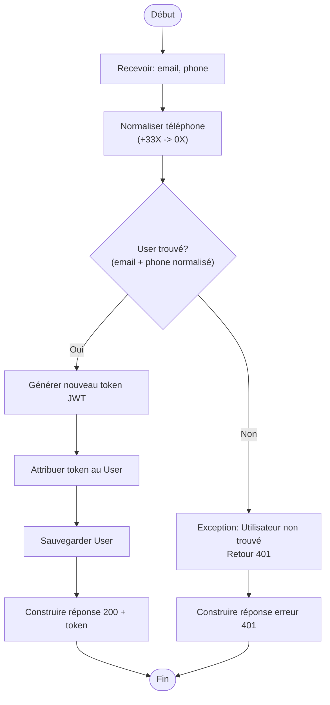

```mermaid
flowchart TD
    Start(["Début"]) --> Input["Recevoir: email, phone"]
    Input --> NormalizePhone["Normaliser téléphone<br/>(+33X -> 0X)"]
    NormalizePhone --> FindUser{"User trouvé?<br/>(email + phone normalisé)"}
    FindUser -->|"Non"| ErrorLogin["Exception: Utilisateur non trouvé<br/>Retour 401"]
    FindUser -->|"Oui"| GenToken["Générer nouveau token JWT"]
    GenToken --> SetToken["Attribuer token au User"]
    SetToken --> SaveUser["Sauvegarder User"]
    SaveUser --> BuildResponse["Construire réponse 200 + token"]
    ErrorLogin --> BuildError["Construire réponse erreur 401"]
    BuildResponse --> Return(["Fin"])
    BuildError --> Return
```