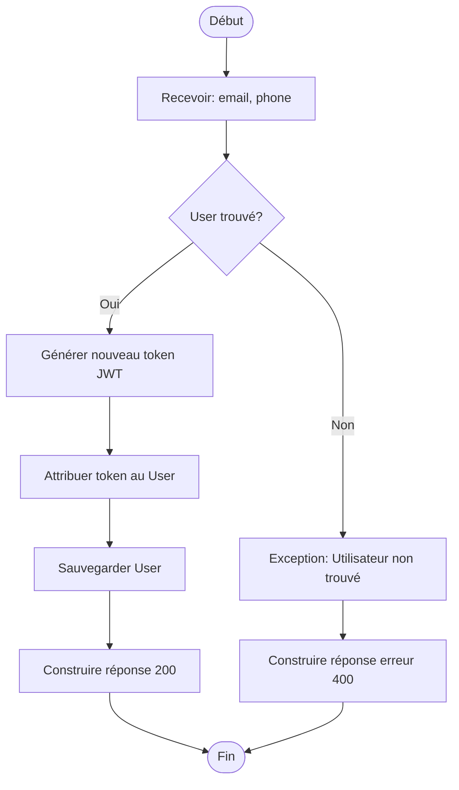

```mermaid
flowchart TD
    Start(["Début"]) --> Input["Recevoir: email, phone"]
    Input --> FindUser{"User trouvé?"}
    FindUser -->|"Non"| ErrorLogin["Exception: Utilisateur non trouvé"]
    FindUser -->|"Oui"| GenToken["Générer nouveau token JWT"]
    GenToken --> SetToken["Attribuer token au User"]
    SetToken --> SaveUser["Sauvegarder User"]
    SaveUser --> BuildResponse["Construire réponse 200"]
    ErrorLogin --> BuildError["Construire réponse erreur 400"]
    BuildResponse --> Return(["Fin"])
    BuildError --> Return
```