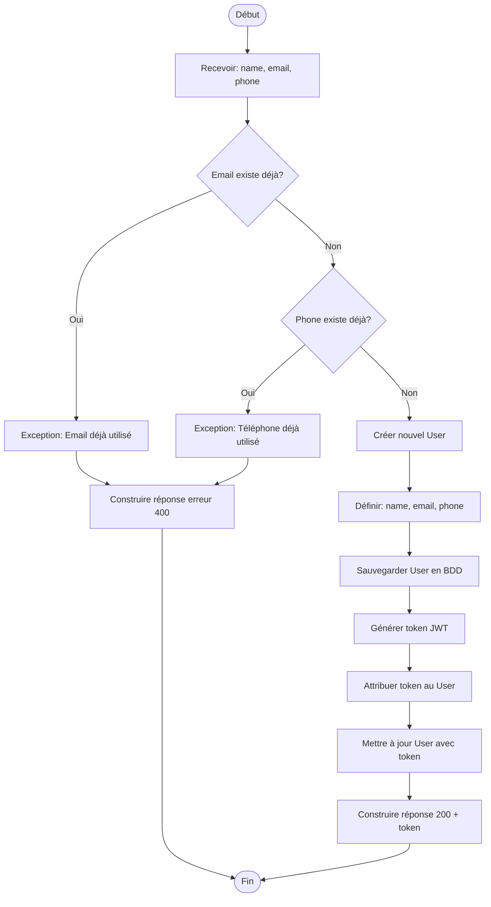

```mermaid
flowchart TD
    Start(["Début"]) --> Input["Recevoir: name, email, phone"]
    Input --> CheckEmail{"Email existe déjà?"}
    CheckEmail -->|"Oui"| ErrorEmail["Exception: Email déjà utilisé"]
    CheckEmail -->|"Non"| CheckPhone{"Phone existe déjà?"}
    CheckPhone -->|"Oui"| ErrorPhone["Exception: Téléphone déjà utilisé"]
    CheckPhone -->|"Non"| CreateUser["Créer nouvel User"]
    CreateUser --> SetFields["Définir: name, email, phone"]
    SetFields --> SaveUser["Sauvegarder User en BDD"]
    SaveUser --> GenToken["Générer token JWT"]
    GenToken --> SetToken["Attribuer token au User"]
    SetToken --> UpdateUser["Mettre à jour User avec token"]
    UpdateUser --> BuildResponse["Construire réponse 200 + token"]
    ErrorEmail --> BuildError["Construire réponse erreur 400"]
    ErrorPhone --> BuildError
    BuildResponse --> Return(["Fin"])
    BuildError --> Return
```