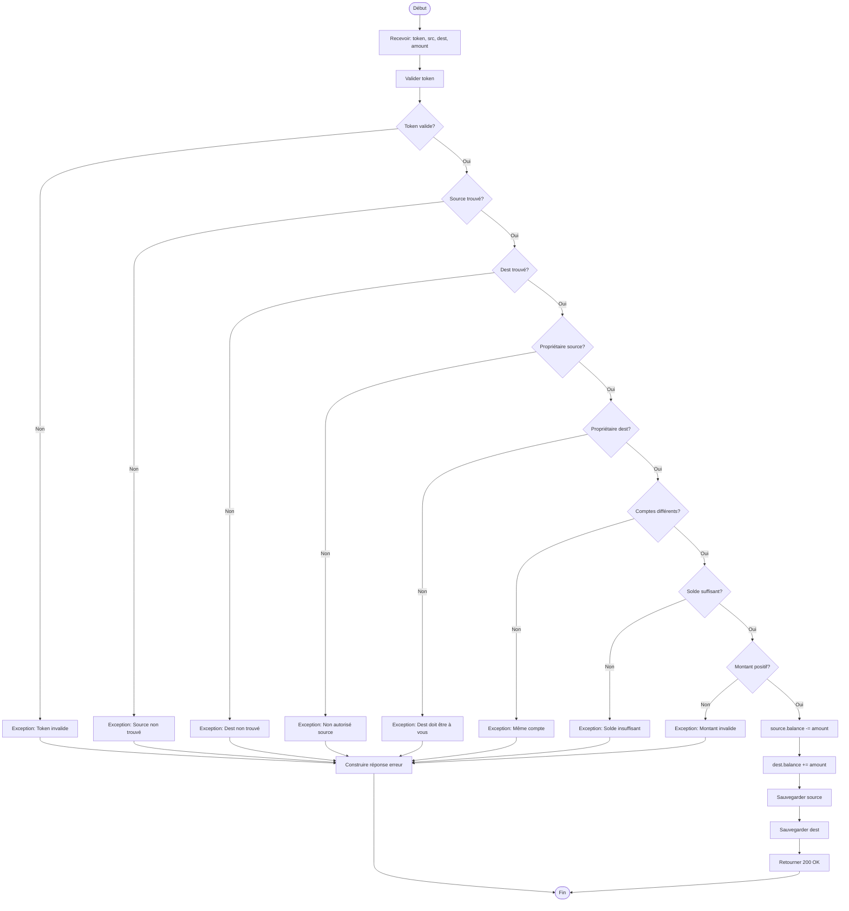

```mermaid
flowchart TD
    Start(["Début"]) --> Input["Recevoir: token, src, dest, amount"]
    Input --> ValidateToken["Valider token"]
    ValidateToken --> ValidToken{"Token valide?"}
    ValidToken -->|"Non"| ErrorToken["Exception: Token invalide"]
    ValidToken -->|"Oui"| FindSrc{"Source trouvé?"}
    FindSrc -->|"Non"| ErrorSrc["Exception: Source non trouvé"]
    FindSrc -->|"Oui"| FindDest{"Dest trouvé?"}
    FindDest -->|"Non"| ErrorDest["Exception: Dest non trouvé"]
    FindDest -->|"Oui"| CheckOwnerSrc{"Propriétaire source?"}
    CheckOwnerSrc -->|"Non"| ErrorOwnerSrc["Exception: Non autorisé source"]
    CheckOwnerSrc -->|"Oui"| CheckOwnerDest{"Propriétaire dest?"}
    CheckOwnerDest -->|"Non"| ErrorOwnerDest["Exception: Dest doit être à vous"]
    CheckOwnerDest -->|"Oui"| CheckDiff{"Comptes différents?"}
    CheckDiff -->|"Non"| ErrorSame["Exception: Même compte"]
    CheckDiff -->|"Oui"| CheckBal{"Solde suffisant?"}
    CheckBal -->|"Non"| ErrorBal["Exception: Solde insuffisant"]
    CheckBal -->|"Oui"| CheckAmt{"Montant positif?"}
    CheckAmt -->|"Non"| ErrorAmt["Exception: Montant invalide"]
    CheckAmt -->|"Oui"| DebitSrc["source.balance -= amount"]
    DebitSrc --> CreditDest["dest.balance += amount"]
    CreditDest --> SaveSrc["Sauvegarder source"]
    SaveSrc --> SaveDest["Sauvegarder dest"]
    SaveDest --> ReturnOK["Retourner 200 OK"]
    ErrorToken --> BuildError["Construire réponse erreur"]
    ErrorSrc --> BuildError
    ErrorDest --> BuildError
    ErrorOwnerSrc --> BuildError
    ErrorOwnerDest --> BuildError
    ErrorSame --> BuildError
    ErrorBal --> BuildError
    ErrorAmt --> BuildError
    ReturnOK --> Return(["Fin"])
    BuildError --> Return
```