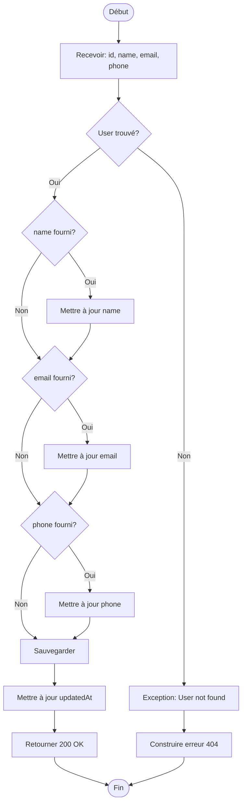

```mermaid
flowchart TD
    Start(["Début"]) --> Input["Recevoir: id, name, email, phone"]
    Input --> FindUser{"User trouvé?"}
    FindUser -->|"Non"| Error404["Exception: User not found"]
    FindUser -->|"Oui"| CheckName{"name fourni?"}
    CheckName -->|"Oui"| SetName["Mettre à jour name"]
    CheckName -->|"Non"| CheckEmail{"email fourni?"}
    SetName --> CheckEmail
    CheckEmail -->|"Oui"| SetEmail["Mettre à jour email"]
    CheckEmail -->|"Non"| CheckPhone{"phone fourni?"}
    SetEmail --> CheckPhone
    CheckPhone -->|"Oui"| SetPhone["Mettre à jour phone"]
    CheckPhone -->|"Non"| SaveUser["Sauvegarder"]
    SetPhone --> SaveUser
    SaveUser --> AutoUpdate["Mettre à jour updatedAt"]
    AutoUpdate --> ReturnUser["Retourner 200 OK"]
    Error404 --> BuildError["Construire erreur 404"]
    ReturnUser --> Return(["Fin"])
    BuildError --> Return
```