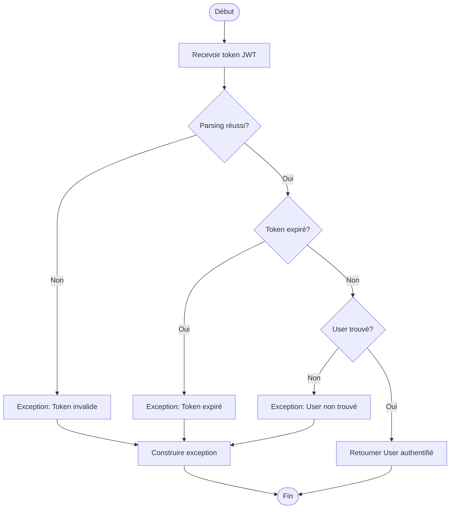

```mermaid
flowchart TD
    Start(["Début"]) --> Input["Recevoir token JWT"]
    Input --> ParseToken{"Parsing réussi?"}
    ParseToken -->|"Non"| ErrorParse["Exception: Token invalide"]
    ParseToken -->|"Oui"| CheckExpiration{"Token expiré?"}
    CheckExpiration -->|"Oui"| ErrorExpired["Exception: Token expiré"]
    CheckExpiration -->|"Non"| FindUser{"User trouvé?"}
    FindUser -->|"Non"| ErrorUser["Exception: User non trouvé"]
    FindUser -->|"Oui"| Success["Retourner User authentifié"]
    ErrorParse --> BuildError["Construire exception"]
    ErrorExpired --> BuildError
    ErrorUser --> BuildError
    Success --> Return(["Fin"])
    BuildError --> Return
```