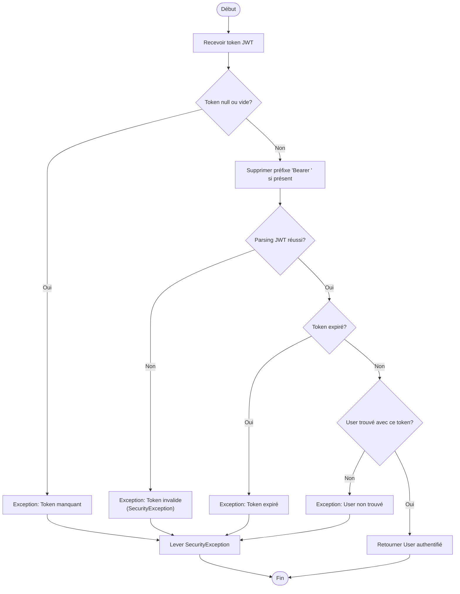

```mermaid
flowchart TD
    Start(["Début"]) --> Input["Recevoir token JWT"]
    Input --> CheckNull{"Token null ou vide?"}
    CheckNull -->|"Oui"| ErrorNull["Exception: Token manquant"]
    CheckNull -->|"Non"| RemoveBearer["Supprimer préfixe 'Bearer ' si présent"]
    RemoveBearer --> ParseToken{"Parsing JWT réussi?"}
    ParseToken -->|"Non"| ErrorParse["Exception: Token invalide<br/>(SecurityException)"]
    ParseToken -->|"Oui"| CheckExpiration{"Token expiré?"}
    CheckExpiration -->|"Oui"| ErrorExpired["Exception: Token expiré"]
    CheckExpiration -->|"Non"| FindUser{"User trouvé avec ce token?"}
    FindUser -->|"Non"| ErrorUser["Exception: User non trouvé"]
    FindUser -->|"Oui"| Success["Retourner User authentifié"]
    ErrorNull --> BuildError["Lever SecurityException"]
    ErrorParse --> BuildError
    ErrorExpired --> BuildError
    ErrorUser --> BuildError
    Success --> Return(["Fin"])
    BuildError --> Return
```